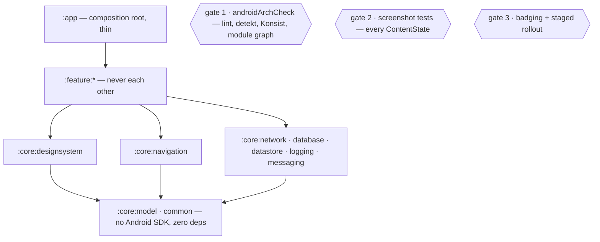

# GenericArch-Android

Reference architecture for building **phone / tablet / foldable** Android apps, with Claude Code as
the thing that enforces it — and a toolchain that runs identically on **Linux, Windows and macOS**.

It ships **rules, docs and tooling — no Kotlin.** You install it into a repo that already has its
Gradle project. Every version, floor and setting is read from your project or your machine, never
written here.


**Contents** — [60-second start](#60-second-start) · [The five commands](#the-five-commands) ·
[What this is](#what-this-is-and-is-not) ·
[The shape](#the-shape) · [Install](#1-install) · [Commands](#2-commands) · [Skills](#3-skills) ·
[CLAUDE.md](#4-claudemd) · [Upgrade & migrate](#5-upgrade--migrate) · [Tasks](#6-tasks) ·
[Pipeline](#7-pipeline) · [Reference](#8-reference)

> **On the name.** The repo is `GenericArch-Android` — the Android counterpart to
> [GenericArch](https://github.com/kalpesh-jetani/GenericArch) (`iOS / iPadOS / macOS — Base Claude
> Setup`). Everything it installs is prefixed `androidArch*` and recorded under `.androidarch/`.
> Design note: [docs/DESIGN-NOTE.md](docs/DESIGN-NOTE.md).

---

## 60-second start

From inside your app repo, on any OS:

```bash
curl -fsSLO https://raw.githubusercontent.com/MalaRuparel2023/GenericArch-Android/HEAD/androidarch.init.gradle.kts
```
```bash
./gradlew --init-script androidarch.init.gradle.kts androidArchBootstrap --dry-run
```
```bash
./gradlew --init-script androidarch.init.gradle.kts androidArchBootstrap --apply
```
```bash
./gradlew androidArchDoctor
```

Line 2 lists what it would add and writes nothing. Only `--apply` writes. `androidArchDoctor` then
prints your resolved stack, which lifecycle step is next, and the exact command to run.

Windows: `gradlew.bat` in place of `./gradlew`. That is the only difference, and it is the point.

### The five commands

Everything this repo asks a developer to remember:

| Command | Answers |
|---|---|
| `./gradlew androidArchDoctor` | Is my environment and project ready? |
| `./gradlew androidArchCheck` | Is this code safe to merge? |
| `./gradlew androidArchTest` | Do the tests pass? |
| `./gradlew assembleEnvDevDebug` | Can I get an APK? *(AGP's task, untouched)* |
| `./gradlew bundleEnvProdRelease` | Can I get the production AAB? *(AGP's task, untouched)* |

Gradle matches abbreviated camel-case, so `./gradlew aAC` runs `androidArchCheck`. Every other task
is internal — find one with `./gradlew androidArchFindTask --q="<what you want>"`.

---

## What this is, and is not

| It is | It is not |
|---|---|
| A governance layer: rules, generated inventories, Gradle tasks, CI | An app template |
| Installed into a repo that already has its project | A `git clone` and start coding |
| Reversible — every written file is hashed in a manifest | Something you rip out by hand |
| Read from your repo — versions, floors, flavours | A place where versions are hardcoded |

It ships **no Kotlin source, no `:core` modules, no Compose components.** If it did, it would rot
the day your app diverged from it.

---

## The shape



Three gates, three questions: *does it follow the rules*, *does it render every state*, *is it safe
to ship*.

---

## 1. Install

### Usage

```bash
./gradlew --init-script androidarch.init.gradle.kts androidArchBootstrap --dry-run
```
```bash
./gradlew --init-script androidarch.init.gradle.kts androidArchBootstrap --apply
```

Then walk the lifecycle, in this order — it is enforced, not advisory:

```
install → /project-init → /gaps → /sync-app-notes → ready
```

```bash
./gradlew androidArchStep --show
```

### Options
| Flag | Effect |
|---|---|
| `--apply` | writes; without it, dry run |
| `--dry-run` · `--yes` | print the plan and stop · skip the prompt |
| `--with-architecture` | take the architecture layer up front: `new-feature`, `/review`, module rows |
| `--with-lint` | Spotless + detekt + Konsist configs |
| `--with-ci` | the five-stage pipeline (§7) |
| `--with-claude-md` | take the base's `CLAUDE.md`; yours is kept at `CLAUDE-BK.md`. Off by default |
| `--in-place` | install over an existing install |
| `--ref <tag>` | pin a version instead of the newest tag |

### What it adds, and what it does not
| | What | Why |
|---|---|---|
| **Copied** | skills · commands · `MAP.tsv` · `TASKS.tsv` · `build-logic/ga` · `androidArchUninstall` | They must be local to work |
| **Scaffolded empty** | `docs/DECISIONS.md` · `docs/GAPS.md` · `.claude/notes/` · `.claude/memory/` | The prose is ours, the answers are yours |
| **Fetched on demand** | `docs/modules/` · `docs/patterns/` | A product should not carry docs for layers it does not have |
| **Opt-in** | `--with-lint` · `--with-ci` | Lint enforces conventions a product may have declined |
| **Never** | your `CLAUDE.md` · your `.claude/settings.json` · this repo's decisions and notes | Your rules are yours |

### Notes
- The target repo must already have a Gradle project with a wrapper. An empty directory is refused.
- `androidArchInstall` records every file it wrote, with a **newline-normalised** hash, in
  `.androidarch/manifest-v<version>.json`. That manifest is what makes the install reversible.
- There is no "start from the template" path. A copy no installer wrote has no manifest.
- `./gradlew androidArchCheck` is **expected to fail** on an existing codebase. That is the point.
- Your rules win by default. For a hard conflict — XML views vs Compose, Groovy vs KTS — the usual
  answer is *adopt for new code only* ([docs/ADOPTION.md](docs/ADOPTION.md)).
- Out of order the lifecycle commands would not fail, they would **succeed against the wrong
  input**. Exit 5 means an earlier step has not run ([docs/SEQUENCE.md](docs/SEQUENCE.md)).

## 2. Commands

You type these. Anything that must never trigger by inference is a command, not a skill.

| Command | Does |
|---|---|
| `/project-init` | Adopt into an existing repo — reconciles conflicting rules, approval first |
| `/gaps` | Triage `docs/GAPS.md` |
| `/sync-app-notes` | Rebuild the eleven inventories — incremental, only what changed |
| `/find` | One lookup for a screen, route, endpoint, string key, colour, drawable or module |
| `/decide` | Record a settled decision in `docs/DECISIONS.md` |
| `/learn` | Record a resource or finished work; promote a pattern to a skill, or `--task` a repeated step |
| `/verify` | Walk `DONE.md` against the working diff — reports, never fixes |
| `/review` | Review someone else's diff or PR against the rules — reports, never edits |
| `/build` | Assemble, test or bundle a variant — **and this is the consent §2.12 requires** |
| `/upgrade-stack` | Reconcile AGP/Gradle/Kotlin/SDK with the machine — asks twice |
| `/release` | Prepare a release: version bump, changelog, checklist walked against the diff. **Emits commands, never runs them** |
| `/sync-with-base` | Take upstream base updates |

### Notes
- **Commands are not the five verbs.** The five in [The five commands](#the-five-commands) are the
  daily build surface; these are the lifecycle and authoring surface. A developer needs the five; an
  adopter needs these.
- The first three are lifecycle steps and run in that order. The rest run in any order once `ready`.
- `/sync-app-notes` and `/build` are commands precisely because a full rescan or a build must never
  fire by inference.
- `/release` is `EMIT_ONLY`: it walks the checklist and **prints** the commands. Nothing about a
  Play upload is one inferred tool call away.

## 3. Skills

You never type these — they activate from their description.

| Skill | Fires when | What it stops you doing |
|---|---|---|
| `new-feature` | adding a feature, screen or module | shipping a happy path — it requires every content state, a fake, and string resources |
| `debug` | something is broken, blank, or silently wrong | reading the wrong file first; it narrows to a layer before opening anything |

```bash
./gradlew androidArchCheckSkillTriggers
```

### Notes
- **Only two ship, deliberately.** Anything expressible as a task is a task: a skill costs context
  every session through its description; a task costs nothing until called.
- A description is **trigger phrases, never a summary of the body.** A summary makes the skill fire
  on work it does not own — that is a description bug, and the trigger test is what catches it.

## 4. CLAUDE.md

Loaded in full on **every** session, so it holds only what binds while writing code.

| File | Loaded | Holds |
|---|---|---|
| `CLAUDE.md` | every session — **budget: 4,500 tokens, checked by `androidArchCheckSections`** | §0–§12 |
| `docs/BUILD-PROCESS.md` · `DEPLOYMENT-PROCESS.md` · `PROJECT-SETTINGS.md` | when the task is that | building a variant · shipping and rolling back · SDKs, permissions, secrets |
| `docs/` reference · `.claude/notes/` | on lookup | the reasoning, and the code's own inventory |

```bash
grep -i navigation .claude/MAP.tsv
```
```bash
awk -F'\t' '$2=="module"' .claude/MAP.tsv
```
```bash
./gradlew androidArchFind --q=SkillAssessmentScreen
```

`.claude/notes/` holds eleven inventories generated from your code, meant to be **searched, never
read**. If you had to read one in full, the row was not self-contained — fix the row.

## 5. Upgrade & migrate

### Usage

```bash
./gradlew androidArchAdoptReview
```
```bash
./gradlew androidArchRemove --path=docs/patterns/paging.md --reason="we use manual cursors"
```
```bash
./gradlew androidArchReseal --path=CLAUDE.md
```

An upgrade is uninstall-then-install at the new `--ref`; `androidArchAdoptReview` is what tells you
which upstream changes are waiting, and exits 1 while decisions are pending — so it doubles as a CI
staleness gate.

### Notes
- A file is removed only while its hash still proves it is the base's — that contract is what stops
  `androidArchUninstall` deleting something you wrote.
- **Never `rm` an installed file.** `androidArchRemove` tombstones it so the next install does not
  re-create it, prunes its registry rows, and records the reason under *Do not re-propose*.
- Absent from disk and never installed are the same state to an installer.

## 6. Tasks

**There is deliberately no table of tasks here.** `.claude/TASKS.tsv` is generated from each task's
declared metadata, so it cannot drift. Listing them by hand is the one place this file could.

```bash
./gradlew androidArchFindTask --q="are the notes out of date"
```
```bash
grep -i lint .claude/TASKS.tsv
```
```bash
awk -F'\t' '$4!="call"' .claude/TASKS.tsv
```

### The `claude` column
| Value | Means |
|---|---|
| `call` | run it |
| `emit-only` | it prints commands it deliberately does not run |
| `needs-approval` | it writes; needs an explicit `--approve` |
| `never:<reason>` | the agent must not run it |

### Notes
- **Five tasks are public; the rest are internal.** Internal means invoked by the five, by a command
  file, or by CI — never something a developer is told to memorise. `androidArchFindTask` is how you
  rediscover one.
- **AGP's tasks are never reimplemented.** `assembleDebug` and `bundleRelease` stay Google's;
  this layer gates and validates around them.
- **Runs on Linux, Windows and macOS.** JDK 17 and the committed Gradle wrapper are the only
  requirements. No bash, no `sed`, no `shasum`.
- The `when` field carries the phrases someone would actually *ask*, and `androidArchFindTask` scores
  against those first — which is why "is the memory store consistent" reaches
  `androidArchVerifyMemory` without knowing its name.
- `androidArchRegisterTasks --check` refuses a task with incomplete metadata, so a task cannot be
  added without stating its contract.

## 7. Pipeline

One rule: **all build logic lives in Gradle. CI files contain no logic** — only checkout, toolchain,
secrets, and `./gradlew <task>`. That is what makes it portable across OSes and providers.

| Stage | Trigger | Runner | Target |
|---|---|---|---|
| 0 · local | pre-commit | any OS | < 20 s |
| 1 · PR | every push | ubuntu | < 12 min |
| 2 · integration | merge | ubuntu + GMD | < 25 min |
| 3 · candidate | tag `v*` | ubuntu, signed | < 30 min |
| 4 · promotion | manual | — | minutes |

Plus a **weekly three-OS matrix** — the job that keeps the cross-platform promise honest.
Full reference, secrets model, versioning and rollback: [docs/DELIVERY.md](docs/DELIVERY.md).

## 8. Reference

### Start here
| You want to… | Read |
|---|---|
| Get a signal in 60 seconds | [60-second start](#60-second-start) |
| Know the rules before writing code | [CLAUDE.md](CLAUDE.md) |
| Find the doc for a topic | `grep -i <topic> .claude/MAP.tsv` |
| Find *which task already does this* | `./gradlew androidArchFindTask --q="<what you want>"` |
| Find *where something is* | `./gradlew androidArchFind --q=<name>` |
| Know which command runs next, or why one refused | `./gradlew androidArchStep --show` · [docs/SEQUENCE.md](docs/SEQUENCE.md) |
| Know the resolved stack | `.claude/notes/PROJECT.md` |
| Understand a specific layer | [docs/modules/](docs/modules/) |
| Know why something is the way it is | [docs/DECISIONS.md](docs/DECISIONS.md) |
| Know what is deliberately missing | [docs/GAPS.md](docs/GAPS.md) |
| Set up a machine, or ship | [docs/BUILD-PROCESS.md](docs/BUILD-PROCESS.md) · [docs/DELIVERY.md](docs/DELIVERY.md) |
| Know when a change is actually finished | [docs/DONE.md](docs/DONE.md), or `/verify` |
| Know where a new doc belongs | [docs/STRUCTURE.md](docs/STRUCTURE.md) |
| Know what earlier sessions learned | `.claude/memory/INDEX.md` |
| Read the reasoning behind all of it | [docs/DESIGN-NOTE.md](docs/DESIGN-NOTE.md) |

### Layout
```
CLAUDE.md                   the rules that bind while writing code — every session
androidarch.init.gradle.kts the one file you curl into a target repo; bootstraps the rest
build-logic/                the enforcement seam — convention plugins and every androidArch* task
docs/                       the reasoning: why it is this way, what is missing, when it is done
  modules/                  one row per module — what it owns, what it may depend on
  patterns/                 procedures not yet worth a skill
.claude/MAP.tsv             the router — grepped, never read
.claude/TASKS.tsv           generated task registry — the contract of every task
.claude/INDEX.md            what THIS product has (MAP.tsv is what the base provides)
.claude/notes/              eleven generated inventories — searched, never read
.claude/memory/             what earlier sessions learned — in-repo, tracked, survives a clone
.claude/skills/             exactly two: new-feature, debug
.claude/commands/           the lifecycle and authoring surface — typed, never inferred
.github/workflows/          the pipeline; no logic, only ./gradlew calls
.androidarch/               install record: manifest, TOMBSTONES.tsv, STEPS.tsv
```

### Status

**Specified and written:** the rules (`CLAUDE.md`), the docs skeleton, `MAP.tsv`, the two skills,
the twelve commands, the design note.

**Specified, not yet implemented:** every `androidArch*` Gradle task, `TASKS.tsv` generation, the
install manifest, and the pipeline. Build order and what each step is worth:
[docs/DESIGN-NOTE.md §12](docs/DESIGN-NOTE.md). What is deliberately absent, and why:
[docs/GAPS.md](docs/GAPS.md).
